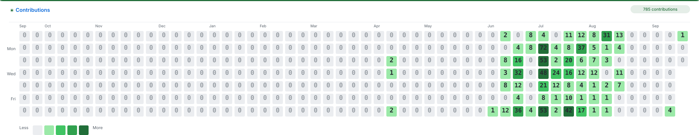
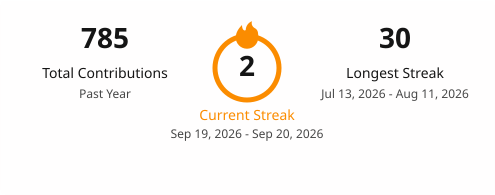

<!-- GitHub contribution statistics -->

  <picture>
    <source
      media="(prefers-color-scheme: dark)"
      srcset="./profile/contribution-dark.svg"
    />
    
  </picture>

<!-- GitHub streak statistics -->

  <picture>
    <source
      media="(prefers-color-scheme: dark)"
      srcset="./profile/streak-dark.svg"
    />
    
  </picture>

